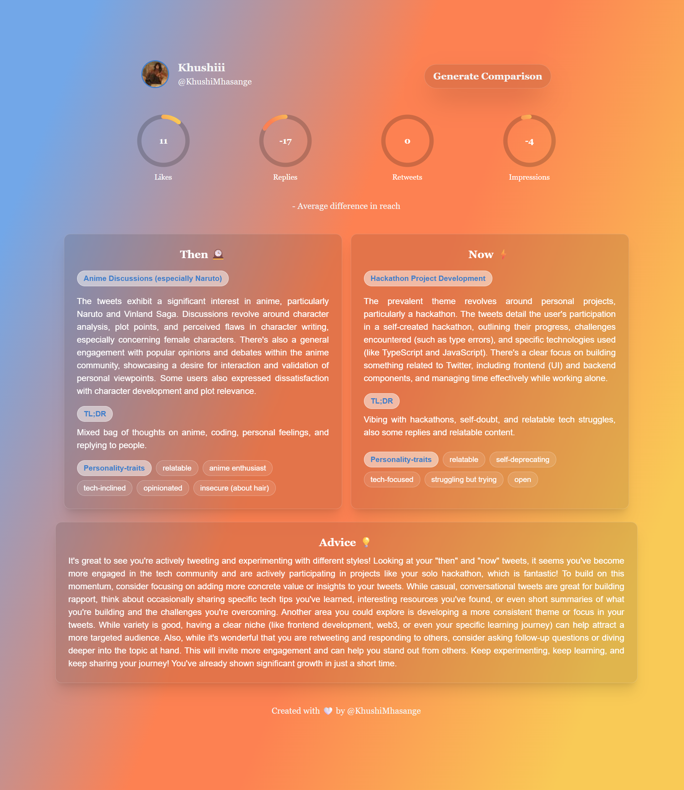

## 🧠 You vs You — Tweets Comparison Now Vs Then

**Compare your past and present Twitter self.**
This app fetches your old and new tweets, analyzes the shift in your personality, themes, and engagement — and gives you a summary of your growth and an advice on what can be improved.

---

### 🖼️ Preview



---

### ⚙️ Tech Stack

* **Frontend:** React + TailwindCSS
* **Backend:** Nodejs + Python
* **AI/NLP:** Google Gemini API
* **Auth:** Twitter OAuth
* **Deployment:** Localhost (for now)

---

### 📦 Setup Instructions

#### 1. Clone the repo

```bash
git clone https://github.com/KhushiMhasange/YouVsYou-Tweets.git
cd YouVsYou-Tweets
```

#### 2. Install dependencies

For both frontend and backend folders :

```bash
npm install
# or
pip install -r requirements.txt
```

#### 3. Create a `.env` file

```env
API_KEY=your_twitter_api_key
API_SECRET_KEY=your_twitter_secret_key
GEMINI_API_KEY=your_gemini_api_key
```

#### 4. Run the app

* **Frontend:**

```bash
npm run dev
```

* **Backend:**

```bash
npm start

```

---

### 📁 Folder Structure

```bash
YouVsYou-Tweets/
├── backend/            
├── frontend/                           
├── README.md
└── ...
```

---

### 🙋‍♀️ Author

**Khushi Mhasange**
🔗 [@KhushiMhasange](https://twitter.com/KhushiMhasange)

---

Let me know if there is any issues with the setup.
